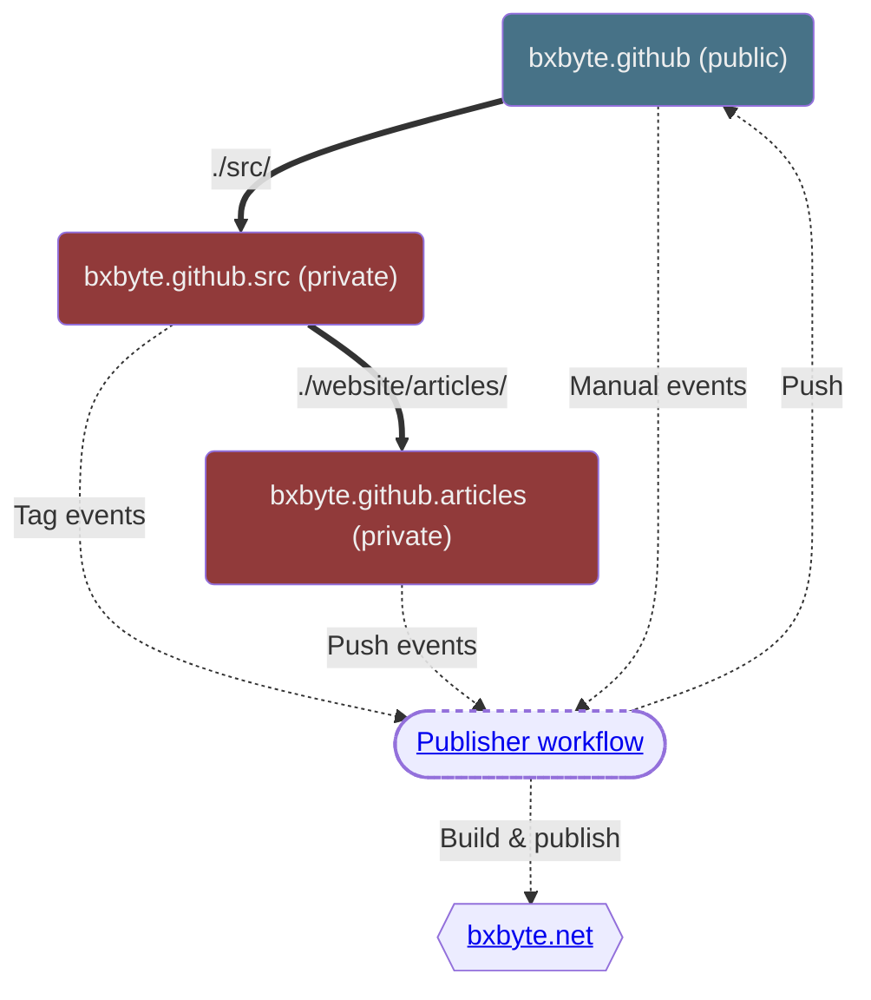

# Wait ... where is the source code ?

<link href="" rel="stylesheet">
As you can see, none of the source code is stored here, as it came from a submodule, a private repo of me used to hide you from the horrible mess that this website is.

