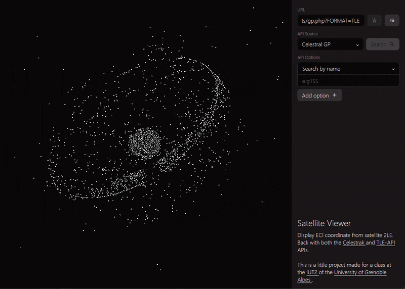

## Context

As part of a JavaScript course at IUT2 of Grenoble Alpes University,
we were asked to create a JavaScript mini-project to interact
with an API and save certain searches as favorites, with the project structured in an Object-Oriented Model (MVC) format.

## Implementation

To propose something original, I decided to create a basic visualization
of satellite coordinates orbiting around Earth available through the community API

<a href={frontmatter.links.celestrak}>Celestrak</a> and
<a href={frontmatter.links.tle}>TLE-API</a>, the latter also being based on
Celestrak, but with fewer usage limitations.

The tool allows viewing the evolution of satellite coordinates at accelerated speed ($\times 1000$),
explorable through a simple search bar and options depending on the API used.

## Technical Details

The code is written in pure vanilla JavaScript, without any libraries.
The JavaScript is separated into three parts following the MVC pattern:
one for the form, one for the canvas where satellites are displayed,
and one for the favorites system.

Ignoring many technical details, it's worth noting the use of
a numerical equation solving system that extracts coordinates
at time $t$ of a satellite from its TLE, a set of physical parameters
describing the satellite's elliptical motion. The implementation is based on this <a href={frontmatter.links.paper}>paper</a>
by Mr. René Schwarz.

The source code is available on GitHub: <a href={"https://" + frontmatter.links.repo}>{frontmatter.links.repo}</a>
